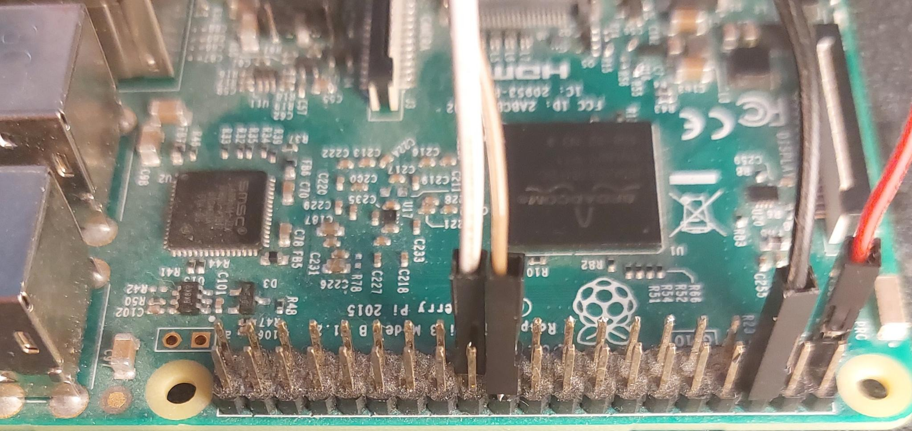
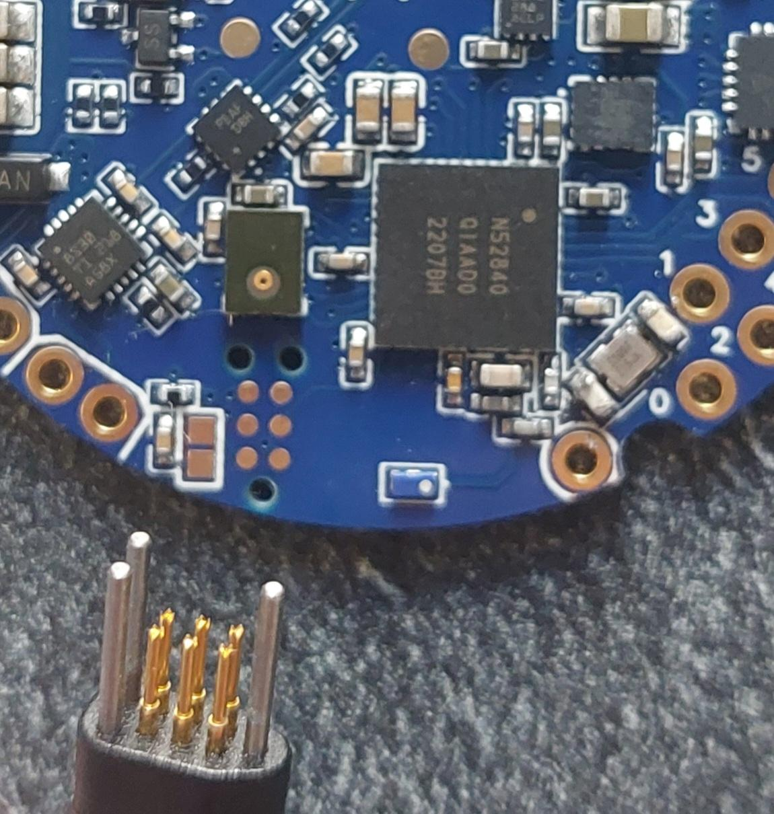

# Flash process

When you receive the integrated circuit, the NRF52840 microcontroler will not have a bootloader.

I used the XIAO Seed Sense bootloader, that allow the user to program the microcontroler via USB.

To flash the bootloader for the first time, you must use a computer with GPIOs (I'm using a raspberry Pi) with openocd, or a JTAG connector.

You need to get the XIAO Seed Sense bootloader [can be found here](https://github.com/0hotpotman0/BLE_52840_Core.git), under the bootloader folder.

Wire correspondance:

- white is the CL pin
- brown is the IO pin
- Black is the GND pin
- Red is the 3.3V pin

You can run openocd next to the openocd.cfg to flash the board.

The process should end with no errors, and openocd should close itself.
